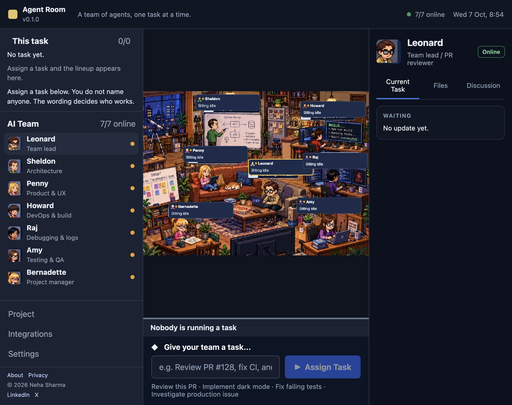

# Agent Room · Apartment 4A

A local control room for a team of Cursor agents. You assign one task. The app reads the wording, lines up the people who should work, and runs one writer at a time in a folder on your machine.



## How to use it

1. Install and start the app (see [Run locally](#run-locally)).
2. Connect Cursor with an API key or the Integrations panel.
3. In Settings, confirm the folder the agents may edit. The default is `workspace/`.
4. Type one task in **Give your team a task** and choose **Assign Task**. Do not name who should do it.
5. Watch **This task** on the left. It lists the lineup and who is working now.
6. Select a person to read their short update on the right. **Read the full note** opens the longer write-up.
7. When the task finishes, the lineup clears and everyone returns to idle.

Past tasks are under **Project** in the left panel. That list shows the last 8 tasks. The app keeps the last 40 in a local file. Nothing expires by time. The 41st task drops the oldest one the next time the file is saved.

## How the team is chosen

Leonard always starts. The server then adds up to three teammates from the words in the task:

| If the task is about | Who runs after Leonard |
| --- | --- |
| Writing a note or page | Sheldon (structure), Penny (wording), Amy (check) |
| Architecture or design | Sheldon |
| Requirements or UX copy | Penny |
| Build, CI, or scripts | Howard |
| Bugs, logs, or crashes | Raj |
| Tests or a check | Amy |
| Status or progress | Bernadette |
| A question only | Nobody. Leonard answers and stops. |

One person writes at a time. The next person sees the original task and the notes so far.

## Run locally

```bash
npm install
cp .env.example .env.local
npm run dev
```

Open the URL Next prints. Put your key in `.env.local` and restart:

```bash
CURSOR_API_KEY=your_key_from_cursor_dashboard
```

Create the key at [Cursor integrations](https://cursor.com/dashboard/integrations). You can leave the key empty and use **Integrations → Connect Cursor** instead.

```bash
npm test
npm run typecheck
```

This app stays on your computer. It is not a fit for Vercel. The agents need a long-running process, a real project folder, and a local data file.

## Code guidelines

- TypeScript is `strict`. New code should typecheck with `npm run typecheck`.
- The browser never receives the API key. Cursor calls, the data file, and role prompts stay in server modules (`src/lib/orchestrator.ts`, `src/lib/store.ts`, `src/lib/account.ts`). Those files import `server-only`.
- Role prompts live in `src/lib/roster.ts`. Who runs for a task lives in `src/lib/route.ts`. Add a test in `src/lib/route.test.ts` when you change the wording rules.
- The screen is `src/components`. Pages are `src/app`. HTTP routes are `src/app/api`.
- Shared types live in `src/lib/types.ts`. Do not duplicate status names in components.
- Store updates go through `updateStore`. It writes the JSON file atomically. Do not edit `data/store.json` by hand while a task is running.
- Tests use Node's test runner (`node:test`) and `tsx`. Prefer a small pure function and a unit test over a new dependency.

## Best practices

- Describe the outcome in the task. "Write a one-page status note" is enough. Naming Leonard or Penny in the prompt does not assign them.
- Point Settings at the repository you want edited before you assign work. Agents can change files in that folder.
- Keep `CURSOR_API_KEY` in `.env.local`. That file is gitignored. Do not paste the key into the README, issues, or chat logs.
- Assign one task at a time. A second assignment is rejected while the team is busy.
- Read a failure on the right panel before assigning the same task again. A stopped person stays blocked until the next assignment resets the team to idle.
- Treat `workspace/` as the agents' scratch folder. Only `workspace/hello.txt` is part of this repo. Other files there stay on your machine.

## Layout

```text
src/app            pages and API routes
src/components     room, roster, and inspector
src/lib            roster, routing, store, and the Cursor run
public             room art and portraits
docs/screenshot.png
workspace          default folder agents edit
```

## Privacy

What stays on this machine, and what is sent to Cursor, is written up at `/privacy` in the running app and in `src/app/privacy/page.tsx`.

© 2026 Neha Sharma
