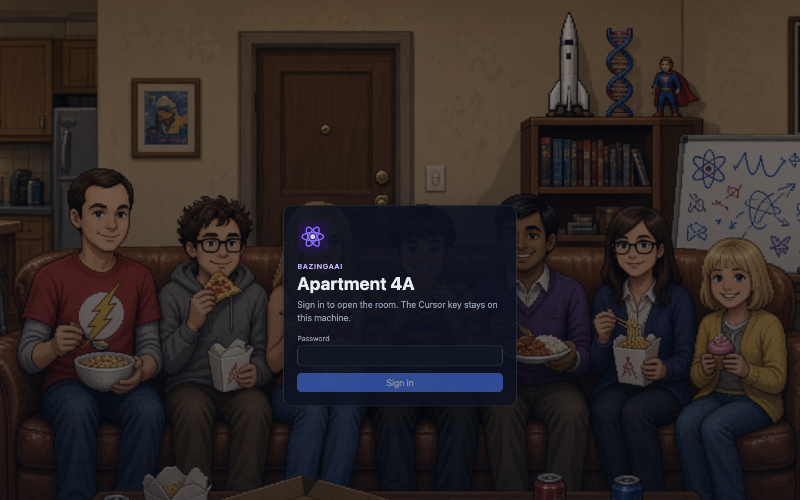
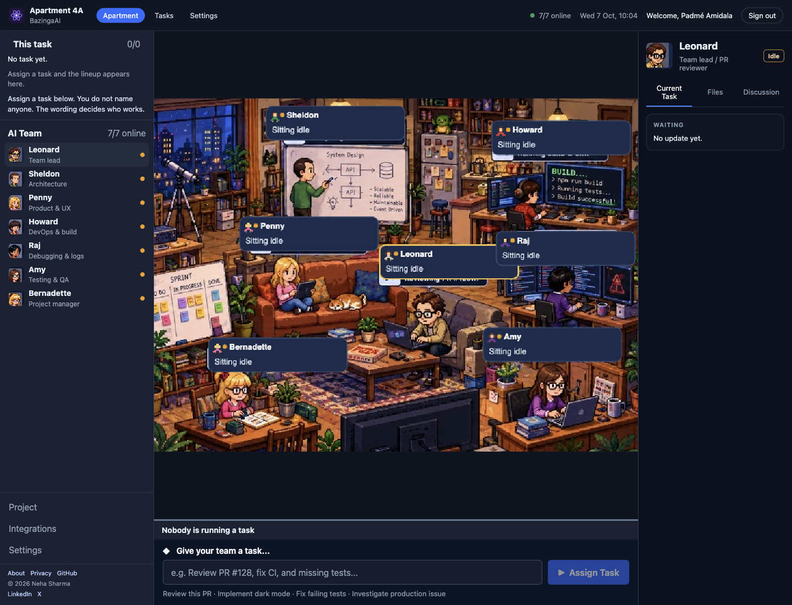

# Apartment 4A

A local control room for a team of Cursor agents. You assign one task. The app reads the wording, lines up the people who should work, and runs one writer at a time in a folder on your machine.





## Why you sign in

The app is a website on your computer, and `npm run dev` also prints a network address. Anyone who can open that page could otherwise assign tasks and use the Cursor key stored on the machine. Those tasks can edit files in the folder you point at.

The password is the lock on that page. You choose it. It lives only in `.env.local` on your machine. Git does not commit that file, and the app does not send the password anywhere. There is no Apartment 4A account.

Until `APP_PASSWORD` is set, the room stays closed. After you sign in, this browser stays signed in for 7 days. **Sign out** is in the top-right corner.

## How to use it

1. Install and start the app (see [Run locally](#run-locally)).
2. Sign in with the password you put in `.env.local`.
3. Connect Cursor with an API key or the Integrations panel. The team edits files in `workspace/` on the computer running the app.
4. Type one task in **Give your team a task** and choose **Assign Task**. Do not name who should do it.
5. Watch **This task** on the left. It lists the lineup and who is working now.
6. Select a person to read their short update on the right. **Read the full note** opens the longer write-up.
7. When the task finishes, the lineup clears and everyone returns to idle. Sign out from the top-right corner when you are done.

Past tasks are under **Tasks**. That list shows the last 8 tasks. The app keeps the last 40. Nothing expires by time. The 41st task drops the oldest one the next time the record is saved. On your computer that record is `data/store.json`. On a server, set `DATABASE_URL` and the same record lives in Postgres.

## How the team is chosen

Leonard always starts. The server then adds up to three teammates from the words in the task:

| If the task is about | Who runs after Leonard |
| --- | --- |
| Writing a note or page | Sheldon (structure), Penny (wording), Amy (check) |
| Architecture or design | Sheldon |
| Requirements or UX copy | Penny |
| Build, CI, or scripts | Howard |
| Bugs, logs, or crashes | Raj |
| Tests or a check | Amy |
| Status or progress | Bernadette |
| A question only | Nobody. Leonard answers and stops. |

One person writes at a time. The next person sees the original task and the notes so far.

## Run locally

You need Node.js and npm. From a copy of this repo:

```bash
git clone https://github.com/Neha/apartment-4a.git
cd apartment-4a
npm install
cp .env.example .env.local
```

Open `.env.local` and set a password only you know. Leave the Cursor key empty for now if you will connect from the page later.

```bash
APP_PASSWORD=choose-a-password
CURSOR_API_KEY=
CURSOR_MODEL=composer-2.5
```

Start the app:

```bash
npm run dev
```

Open the local URL Next prints, usually http://localhost:3000. Sign in with the password you chose. If you change `.env.local`, stop the app and run `npm run dev` again.

To let the team call Cursor, create a key at [Cursor integrations](https://cursor.com/dashboard/integrations) and set `CURSOR_API_KEY` in `.env.local`, then restart. You can leave the key empty and use **Integrations → Connect Cursor** instead.

Do not commit `.env.local`. It holds the password and, if you set one, the Cursor key.

Check the project with:

```bash
npm test
npm run typecheck
```

This app needs a long-running process. It is not a fit for Vercel. Agents edit files in `workspace/` on the machine running the app.

To host it, set `DATABASE_URL` to a Postgres database. Tasks, discussion, agent status, every file path the team touches, and a log of those steps stay there across deploys. People using the site do not manage a data file. The team still writes project files in `workspace/` on the server. Mount that folder if those files should remain after a new container. The database keeps the path of each file, not a copy of the file.

## Code guidelines

- TypeScript is `strict`. New code should typecheck with `npm run typecheck`.
- The browser never receives the API key. Cursor calls, the data file, and role prompts stay in server modules (`src/lib/orchestrator.ts`, `src/lib/store.ts`, `src/lib/account.ts`). Those files import `server-only`.
- Role prompts live in `src/lib/roster.ts`. Who runs for a task lives in `src/lib/route.ts`. Add a test in `src/lib/route.test.ts` when you change the wording rules.
- The screen is `src/components`. Pages are `src/app`. HTTP routes are `src/app/api`.
- Shared types live in `src/lib/types.ts`. Do not duplicate status names in components.
- Store updates go through `updateStore`. With `DATABASE_URL` it writes one Postgres row. Without it, it writes `data/store.json` atomically. Do not edit that file by hand while a task is running.
- Tests use Node's test runner (`node:test`) and `tsx`. Prefer a small pure function and a unit test over a new dependency.

## Best practices

- Describe the outcome in the task. "Write a one-page status note" is enough. Naming Leonard or Penny in the prompt does not assign them.
- The team edits files on the computer where Apartment 4A is running, in `workspace/`. Run the app on your own computer when the files should stay with you.
- Keep `APP_PASSWORD` and `CURSOR_API_KEY` in `.env.local`. That file is gitignored. Do not paste the password or the key into the README, issues, or chat logs.
- Assign one task at a time. A second assignment is rejected while the team is busy.
- Read a failure on the right panel before assigning the same task again. A stopped person stays blocked until the next assignment resets the team to idle.
- Treat `workspace/` as the agents' scratch folder. Only `workspace/hello.txt` is part of this repo. Other files there stay on your machine.

## Layout

```text
src/app            pages and API routes
src/components     room, roster, and inspector
src/lib            roster, routing, store, and the Cursor run
public             room art and portraits
docs/login.png     sign-in screen
docs/room.png      the room after sign-in
workspace          default folder agents edit
```

## Privacy

What stays on this machine, and what is sent to Cursor, is written up at `/privacy` in the running app and in `src/app/privacy/page.tsx`.

© 2026 Neha Sharma
